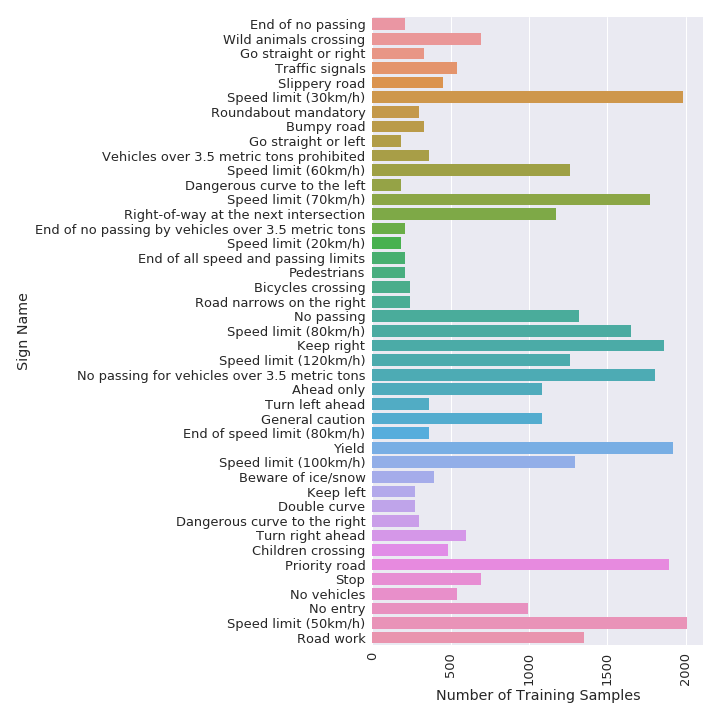
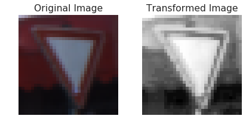
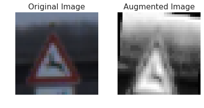
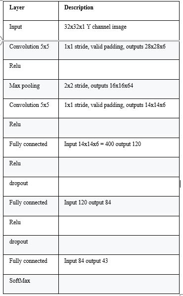
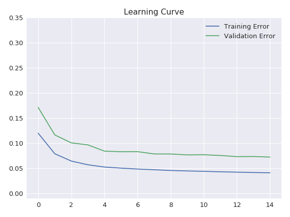
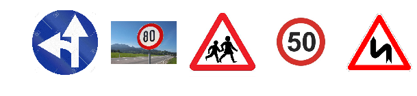

# Traffic-Sign-Classifier

## The goals / steps of this project are the following:

•	Load the data set (see below for links to the project data set)

•	Explore, summarize, and visualize the data set

•	Design, train and test a model architecture

•	Use the model to make predictions on new images

•	Analyze the SoftMax probabilities of the new images

•	Summarize the results with a written report
________________________________________
## Data Set Summary & Exploration

•	The size of training set is 34799

•	The size of the validation set is 4410

•	The size of test set is 12630

•	The shape of a traffic sign image is (32, 32, 3)

•	The number of unique classes/labels in the data set is 43

Exploratory visualization of the data set- A bar chart showing how the data is distributed by labels.
 
Mean of Train examples per class is  809 minima is 180 maxima is 2010. Also, from the graph it can be observed that 
Using Counter from collections I found the list of most common and rare signs:

## Most common sign names

•	'Speed limit (50km/h)'  train samples: 2010

•	'Speed limit (30km/h)'  train samples: 1980

•	'Yield'  train samples: 1920

•	'Priority road'  train samples: 1890

•	'Keep right'  train samples: 1860

•	'No passing for vehicles over 3.5 metric tons'  train samples: 1800

•	'Speed limit (70km/h)'  train samples: 1770

•	'Speed limit (80km/h)'  train samples: 1650

•	'Road work'  train samples: 1350

•	'No passing'  train samples: 1320

## Most rare signs:

•	'Go straight or left'  train samples: 180

•	'Dangerous curve to the left'  train samples: 180

•	'Speed limit (20km/h)'  train samples: 180

•	'End of no passing'  train samples: 210

•	'End of no passing by vehicles over 3.5 metric tons'  train samples: 210

•	'End of all speed and passing limits'  train samples: 210

•	'Pedestrians'  train samples: 210

•	'Bicycles crossing'  train samples: 240

•	'Road narrows on the right'  train samples: 240

•	'Keep left'  train samples: 270
________________________________________

## Design and Test a Model Architecture

## Data Preprocessing:

I followed the published baseline model on this problem that was recommended. Using similar normalization and enhancements the images were transformed in the YUV space and adjusted by histogram sketching and increasing sharpness. As seen in some preliminary experiments full color images seem to confuse the classifier so only the Y channel was selected. This was also stated in the baseline model.

All images were processed by transform_img function. Training set was also augmented by generating 5 additional images from every given image. Images were augmented by augment_img function. The process consisted of random rotation around image center with range between -15 and 15 deg and vertical stretching for getting different viewing angles by random value up to 40 %.

Sample of Original Image and Transformed Image: We can see that there is a reduced level of noise and number of channels.

 
Sample Image after augmentation:

 
## Final Model Architecture:

## Model Training:
I trained the model using an Adam optimizer , learning rate of 1e-4 , dropout rate of 0.3,batch size of 128 and 15 epochs.

Approach taken for finding a solution and getting the validation set accuracy to be at least 0.93:

To train the model, I used the LeNet architecture as it performs well on recognition task with many classes. After a few runs with this architecture I noted that the model tended to overfit to the original training set, in fact the learning curve showed that the training error converged to 99% while the validation error was not giving a satisfactory performance. 

So, I tried dropout and data augmentation to improve the model. I used a dropout rate of 50% and this seemed to slow down overfitting, the model was slower to train but the accuracy was slightly higher.

After adding the augmented dataset, I started seeing an increase in performance , the model was now able to learn within a few epochs and generalized well with the validation set.

A dropout rate of 30% and a learning rate of 1e-4 was selected after a few trial and errors. Training the model takes around an hour for 15 epochs.
Training curves can be seen below, at the end of the curves both training and validation error come closer to each other around 11 epochs. Since I had a limited GPU utilization time, I trained the model for only 15 epochs aiming for the minimum expected validation accuracy of 93%.

My final model results were:

Training set accuracy of 96%

Validation set accuracy of 93%

Test set accuracy of 96%

Test a Model on New Images

Choose five German traffic signs found on the web and provide them in the report. For each image, discuss what quality or qualities might be difficult to classify.

5 randomly chosen German Traffic signs from the internet:

 
Possible challenges while classifying these images:

•	They have more background than training images. Also, the background is different.

•	Contains image artifacts such as jpeg compression problems and copyright trademarks

Discuss the model's predictions on these new traffic signs and compare the results to predicting on the test set.

The images where reshaped and smoothened before testing the model’s accuracy. An accuracy of 33% was achieved while using the model to classify the internet images. A larger dataset and a more powerful GPU would improve the overall efficiency of the model.

The model was able to correctly guess 1 of the 5 traffic signs, which gives an accuracy of ~20%. 

For the label 'Speed limit (50km/h)', the model is sure by 100% about its prediction. However, for other speeds it is 0. This could be a result of image artifact problems like compression which makes it difficult for the model to learn.

It can also be observed that the model learns better with more data. The training categories that have a greater number of images have a better prediction rate.

Describe how certain the model is when predicting on each of the five new images by looking at the SoftMax

## Prediction Results:

For the first image, the model is relatively sure that this is a 'Double curve' (probability of 0.92), and the image does contain a 'Double curve'. The top five soft max probabilities for the remaining 5 labels follow a similar pattern with the first image having the highest probability.

Top 5 Labels for image 'Double curve':
 - 'Road work' with prob = 0.92 
 - 'Speed limit (50km/h)' with prob = 0.04 
 - 'Keep left' with prob = 0.02 
 - 'Right-of-way at the next intersection' with prob = 0.00 
 - 'Roundabout mandatory' with prob = 0.00 

Top 5 Labels for image 'Children crossing':
 - 'Children crossing' with prob = 0.87 
 - 'Right-of-way at the next intersection' with prob = 0.05 
 - 'Bicycles crossing' with prob = 0.03 
 - 'Beware of ice/snow' with prob = 0.01 
 - 'Speed limit (50km/h)' with prob = 0.01 

Top 5 Labels for image 'Speed limit (50km/h)':
 - 'Speed limit (50km/h)' with prob = 1.00 
 - 'Speed limit (80km/h)' with prob = 0.00 
 - 'Speed limit (60km/h)' with prob = 0.00 
 - 'Speed limit (30km/h)' with prob = 0.00 
 - 'Speed limit (100km/h)' with prob = 0.00 

Top 5 Labels for image 'Stop':
 - 'Speed limit (60km/h)' with prob = 0.61 
 - 'Children crossing' with prob = 0.16 
 - 'End of speed limit (80km/h)' with prob = 0.05 
 - 'Right-of-way at the next intersection' with prob = 0.04 
 - 'Dangerous curve to the right' with prob = 0.03 

Top 5 Labels for image 'Go straight or left':
 - 'Turn left ahead' with prob = 1.00 
 - 'Ahead only' with prob = 0.00 
 - 'Go straight or left' with prob = 0.00 
 - 'Priority road' with prob = 0.00 
 - 'Roundabout mandatory' with prob = 0.00 

Top 5 Labels for image 'Speed limit (80km/h)':
 - 'No entry' with prob = 0.50 
 - 'General caution' with prob = 0.23 
 - 'Traffic signals' with prob = 0.09 
 - 'Turn right ahead' with prob = 0.07 
 - 'Children crossing' with prob = 0.04 

